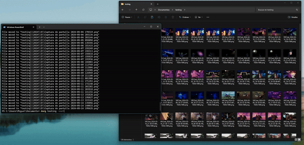

# dorg (Directory Organizer)

dorg is an experimental CLI tool that allows you to quickly organize files in a directory, creating directories and moving files so they are sorted by their creation date.

I created it because I wanted to easily sort my Windows screenshots folder by month.

## Usage

`dorg [directory] [extra arguments]`

Files will be moved and sorted from the specified directory to the current working directory.

## Arguments

- `-r` Recursive: Will also organize directories inside the specified directory recursively. If not, it will only move files in the specified directory.
- `-mode=[day|month]` By default, the software will create a directory for each year, and a directory for each month of the year. If the `day` option is provided instead, it will also create a directory for each day as well.
- `-sort=[created|modified]` Whether to sort files by their creation or modification date. (Default: creation date) 

## Warning

Even though the application works for my use case, it's still a WIP. Be careful when using this with sensitive files.
